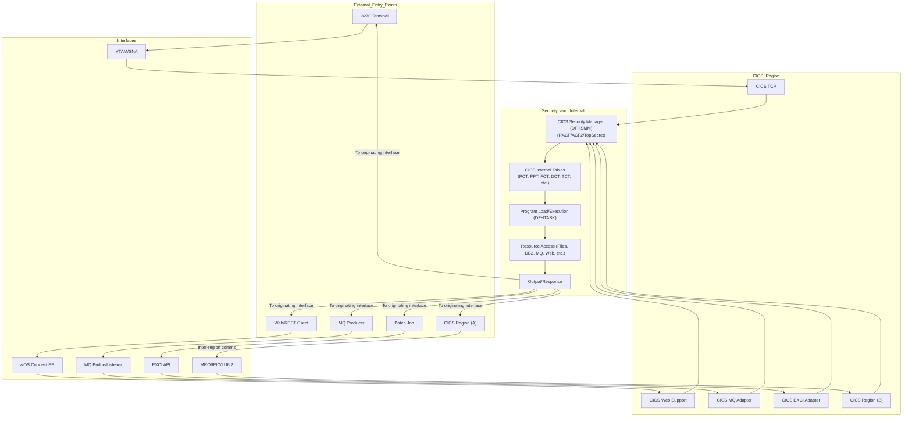

# CICS Architecture Flow (Mermaid Diagram)

---

Copy and paste this Mermaid code block into any markdown editor or tool that supports Mermaid diagrams (such as VS Code with the Mermaid extension, GitHub, or Mermaid Live Editor) to visualize the CICS architecture flow.
