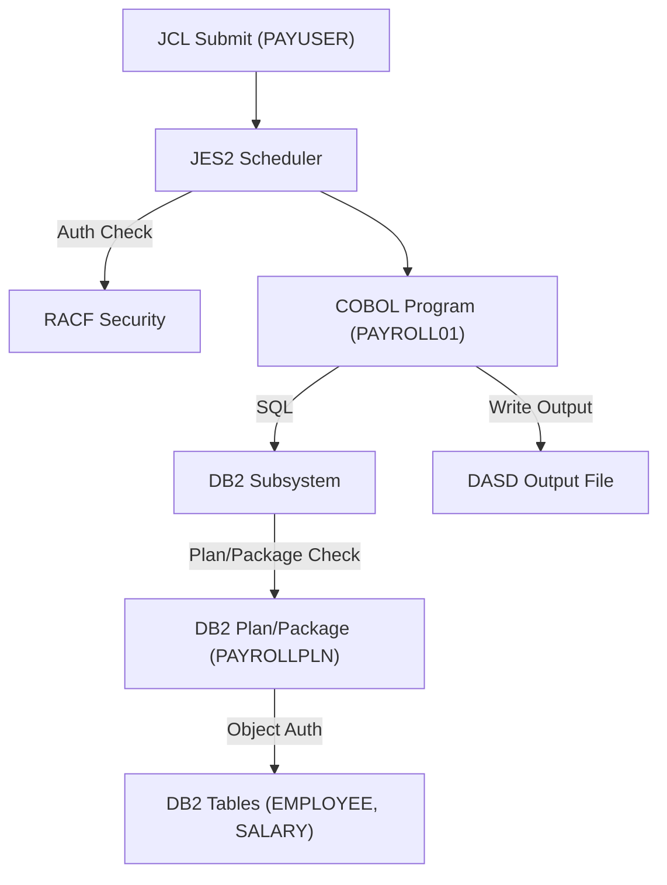

# Mainframe Architecture Overview

## 1. Introduction
Mainframes are powerful enterprise computers designed for high-volume transaction processing, reliability, and security. IBM z/OS is the most widely used mainframe operating system, supporting a rich ecosystem of subsystems and hardware components.

---

## 2. Hardware Components

### 2.1 Central Processor Complex (CPC)
- The physical mainframe box, containing CPUs, memory, and I/O channels.

### 2.2 Logical Partitions (LPARs)
- LPARs are virtualized slices of the CPC, each running its own OS (z/OS, z/VM, Linux on Z, etc.).
- LPARs are managed by PR/SM (Processor Resource/System Manager).
- Each LPAR is isolated for security and resource management, allowing multiple environments on one physical machine.

### 2.3 DASD (Direct Access Storage Device)
- Mainframe disk storage, typically high-reliability RAID arrays.
- Used for datasets, VSAM files, DB2 tablespaces, and system files.

### 2.4 Tape Storage
- Used for backups, archiving, and batch data transfer.
- Managed by subsystems like DFSMS and tape management software.

---

## 3. Mainframe Subsystems

### 3.1 z/OS
- The main operating system, providing multitasking, security, and resource management.

### 3.2 JES2/JES3 (Job Entry Subsystem)
- Manages batch job submission, scheduling, and output.

### 3.3 CICS (Customer Information Control System)
- Online transaction processing subsystem.
- Handles 3270 terminals, web services, MQ, batch-to-CICS, and more.

### 3.4 IMS (Information Management System)
- Hierarchical database and transaction manager.

### 3.5 DB2
- Relational database subsystem.
- Supports SQL, high-volume batch, and online transactions.

### 3.6 MQ (IBM MQ)
- Messaging middleware for asynchronous communication between applications.

### 3.7 RACF (Resource Access Control Facility)
- Security subsystem for authentication, authorization, and auditing.
- Integrates with CICS, DB2, batch jobs, and all resource access.

---

## 4. COBOL-DB2 Integration
- COBOL programs can embed SQL statements using EXEC SQL syntax.
- DB2 precompiler processes SQL, generating calls to DB2 runtime.
- Programs use DB2 plans/packages for execution.
- Security checks (RACF) are performed for DB2 resource access.
- Batch jobs (JCL) or CICS transactions can invoke COBOL-DB2 programs.

---

## 5. Batch Processing, Resource Allocation, and Memory Management

### 5.1 Batch Jobs
- Submitted via JCL (Job Control Language) to JES2/JES3.
- Each job runs in its own address space (can be in its own LPAR).
- Resources (CPU, memory, I/O) are allocated by z/OS scheduler.

### 5.2 RACF Validation
- User credentials and permissions are checked before job execution.
- Dataset, DB2, and subsystem access is validated at runtime.

### 5.3 Memory Management
- z/OS uses virtual storage (paging, real memory allocation).
- Each job/task gets isolated memory regions.
- Resource allocation is managed by WLM (Workload Manager).

---

## 6. Modernization and Cloud Support

### 6.1 API Enablement
- z/OS Connect EE exposes CICS, IMS, and DB2 as RESTful APIs.
- Enables integration with web, mobile, and cloud-native applications.

### 6.2 DevOps and CI/CD
- Mainframe code can be managed with Git, Jenkins, and modern pipelines.
- Automated build, test, and deploy for COBOL, PL/I, and JCL.

### 6.3 Hybrid Cloud
- IBM z/OS supports cloud integration via IBM Cloud Pak for Data, OpenShift, and hybrid cloud connectors.
- Data and workloads can be shared securely with cloud platforms.

### 6.4 Modern User Interfaces
- Web and mobile frontends connect to mainframe APIs.
- 3270 emulation, web services, and mobile SDKs are available.

### 6.5 Containerization
- z/OS Container Extensions (zCX) allow running Linux containers on mainframe hardware.

---

## 7. Security and Resource Management
- RACF is central to authentication and authorization.
- All resource access (datasets, DB2, CICS, MQ) is validated.
- Audit trails and logging are enforced for compliance.
- Memory and CPU resources are managed by z/OS and WLM.

---

## 8. Visual Overview
See the accompanying markdown file for diagrams and flowcharts illustrating mainframe architecture, component interactions, and data flows.

---

## 9. Key Takeaways for Modernization Support
- Understand subsystem roles and integration points.
- Leverage API enablement for web/mobile/cloud.
- Use DevOps tools for mainframe code management.
- Ensure security and compliance with RACF.
- Plan resource allocation and performance with WLM and LPARs.

---

## 10. Further Reading
- IBM Redbooks: "Introduction to the New Mainframe: z/OS Basics"
- IBM Knowledge Center: z/OS, CICS, DB2, RACF documentation
- Mainframe Modernization Patterns (IBM, Broadcom, BMC)

---

## 11. How COBOL-DB2 Programs Work

### 11.1 COBOL-DB2 Program Flow
- COBOL programs can embed SQL statements using EXEC SQL syntax.
- The DB2 precompiler processes these SQL statements, replacing them with calls to DB2 runtime APIs and generating a DBRM (Database Request Module).
- The DBRM is bound into a DB2 plan or package, which defines the access path and authorizations.
- At runtime, the COBOL program is executed (via batch JCL or CICS transaction).
- When the program issues an SQL statement, the DB2 subsystem is invoked.
- DB2 checks:
  - The user’s authority to execute the plan/package (using RACF or DB2 internal security).
  - The program’s authority to access the referenced tables, views, or other objects.
  - Resource limits and access controls.
- If authorized, DB2 executes the SQL and returns results to the COBOL program.

### 11.2 DB2 Subsystem Plan/Package Access Check
- When a COBOL-DB2 program runs, DB2 checks:
  1. **Plan/Package Authorization:** Is the user (or job) allowed to execute the plan/package? (Checked via DB2 catalog and/or RACF)
  2. **Object Authorization:** Does the plan/package have the necessary privileges (SELECT, INSERT, UPDATE, DELETE) on the target tables/views?
  3. **Resource Limits:** Are there any resource constraints (CPU, I/O, locks) that would prevent execution?
- If any check fails, DB2 returns an error (e.g., -551 for authorization failure).

### 11.3 Real-Time Scenario: Payroll Batch Processing

**Scenario:**
A company runs a monthly payroll batch job. The job submits a COBOL-DB2 program (PAYROLL01) via JCL. The program reads employee data from a DB2 table, calculates salaries, and writes output to a DASD file.

**Step-by-Step Flow:**
1. **JCL Submission:**
   - The payroll job is submitted to JES2 with a user ID (e.g., PAYUSER).
2. **RACF Validation:**
   - RACF checks if PAYUSER is authorized to run the job and access required datasets.
3. **Program Execution:**
   - The COBOL program PAYROLL01 starts. It contains embedded SQL to read from the EMPLOYEE and SALARY tables.
4. **DB2 Plan/Package Check:**
   - DB2 checks if PAYUSER (or the job’s auth ID) can execute the bound plan/package (e.g., PAYROLLPLN).
   - DB2 checks if PAYROLLPLN has SELECT access to EMPLOYEE and SALARY tables.
5. **SQL Execution:**
   - The program issues SELECT statements. DB2 retrieves data and returns it to the COBOL program.
6. **Business Logic:**
   - PAYROLL01 calculates salaries, taxes, deductions.
7. **Output:**
   - Results are written to a DASD file (e.g., PAYROLL.OUT).
8. **Job Completion:**
   - JES2 handles output, notifies operations, and logs job completion.

**If Authorization Fails:**
- If PAYUSER lacks access to the plan or tables, DB2 returns an error (e.g., -551), the job abends, and an error is logged.

---

### 11.4 Visual: COBOL-DB2 Batch Flow

---

## 12. More Real-World COBOL-DB2 Batch Examples

### 12.1 Bank End-of-Day Account Reconciliation
**Scenario:**
A bank runs a nightly batch job to reconcile all customer account balances. The COBOL-DB2 program reads transaction records, updates account balances, and generates exception reports for mismatches.

**Flow:**
1. JCL submits the job with a user ID (e.g., BANKBATCH).
2. RACF validates the user and dataset access.
3. The COBOL program reads daily transactions from a DASD file and account data from DB2 tables.
4. For each transaction, the program issues SQL UPDATEs to DB2 to adjust balances.
5. If discrepancies are found, the program writes exception records to a report file.
6. Upon completion, the job produces a summary report and notifies operations.

**Key Points:**
- DB2 plan/package access is checked for UPDATE authority.
- DASD is used for input and output files.
- RACF controls access to both DB2 and datasets.

---

### 12.2 Insurance Claims Batch Processing
**Scenario:**
An insurance company processes claims in bulk every night. The COBOL-DB2 batch job validates claims, updates claim status in DB2, and sends payment instructions to an external system.

**Flow:**
1. JCL submits the claims job with a user ID (e.g., CLAIMSUSR).
2. RACF validates the user and access to claims datasets.
3. The COBOL program reads new claims from a VSAM file (DASD).
4. For each claim, the program issues SQL SELECT and UPDATE statements to DB2.
5. Approved claims are written to a payment instruction file.
6. The file is transmitted to the payment system (could be via MQ or FTP).
7. The job logs results and generates a claims processing report.

**Key Points:**
- DB2 plan/package must have SELECT and UPDATE authority.
- Integration with external systems is common (MQ, FTP, APIs).
- RACF secures all resources.

---

### 12.3 Retail Inventory Batch Update
**Scenario:**
A retail chain updates its inventory every night based on sales data. The COBOL-DB2 batch job reads sales transactions, updates inventory levels in DB2, and flags items for reorder.

**Flow:**
1. JCL submits the inventory job with a user ID (e.g., INVBATCH).
2. RACF validates the user and access to sales and inventory datasets.
3. The COBOL program reads sales data from a sequential file (DASD).
4. For each sale, the program issues SQL UPDATEs to DB2 inventory tables.
5. Items below threshold are flagged and written to a reorder file.
6. The reorder file is sent to the purchasing system.
7. The job produces an inventory status report.

**Key Points:**
- DB2 plan/package must have UPDATE authority on inventory tables.
- Batch jobs often trigger downstream processes (reorder, notifications).
- RACF and DB2 security are enforced at every step.

---

**Document Version:** 1.0  
**Date Created:** January 18, 2026  
**Purpose:** Mainframe Architecture Reference for Modernization Support
