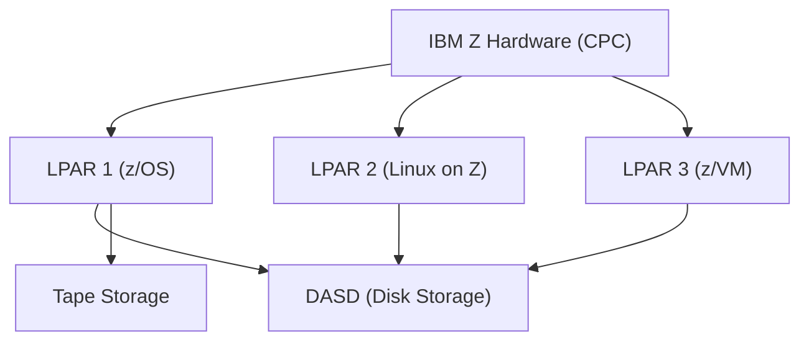
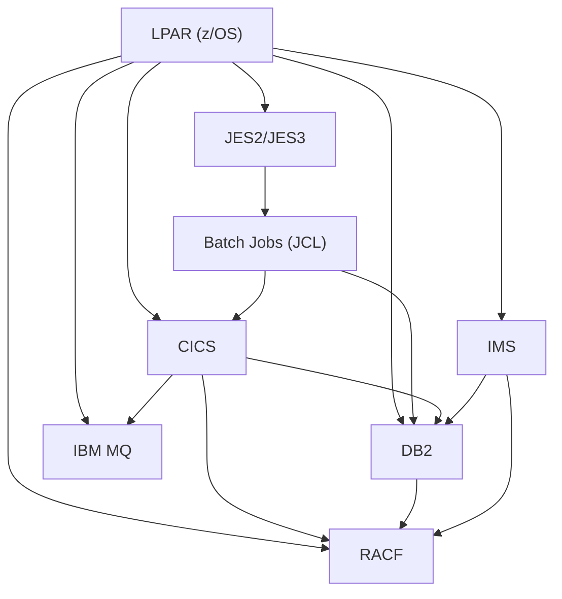
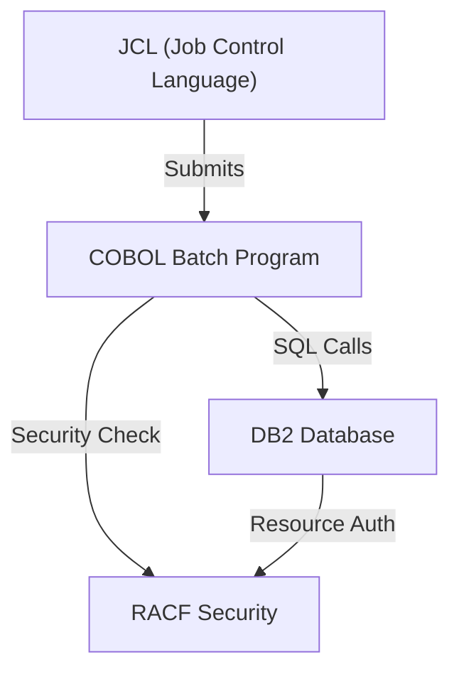
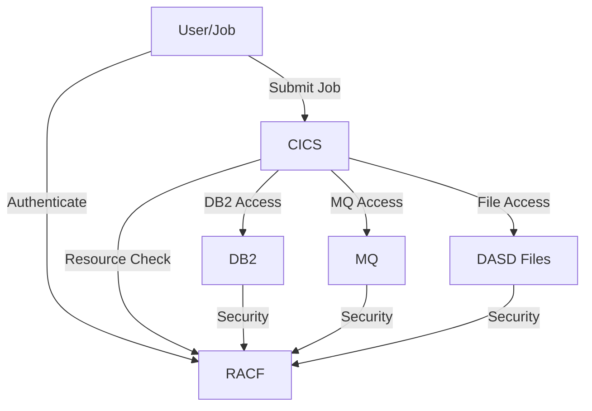
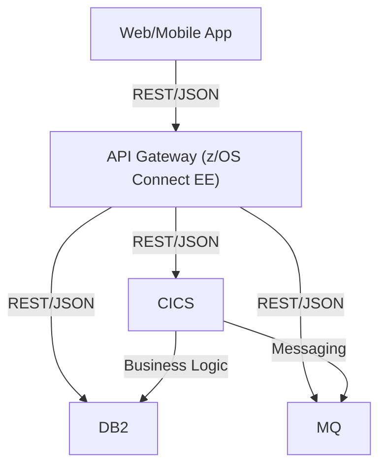
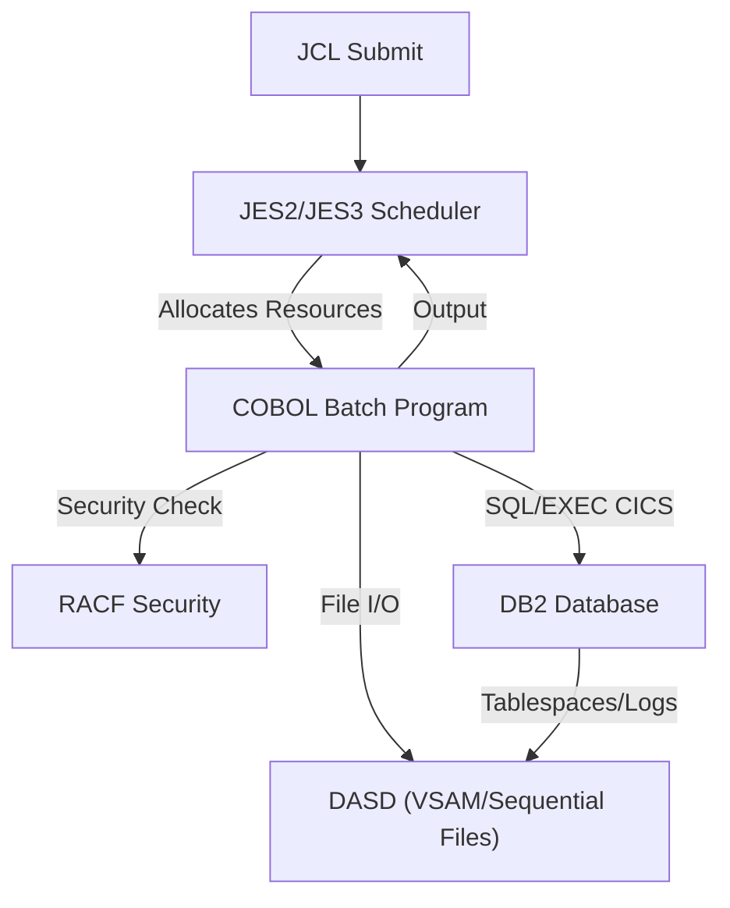
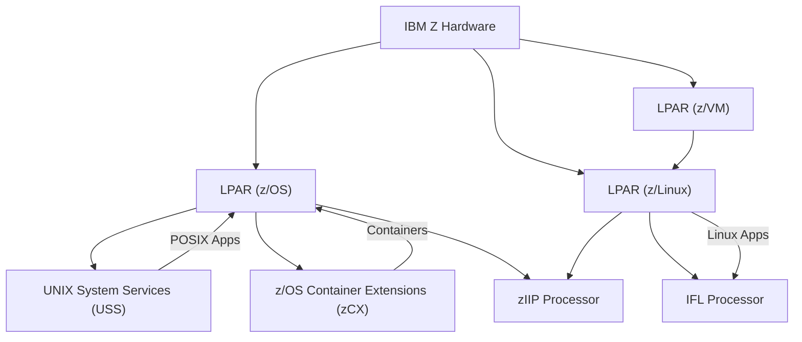

# Mainframe Architecture Visuals

This document provides visual representations of mainframe architecture, including hardware, subsystems, security, batch processing, and modernization integration. Diagrams are provided in Mermaid and ASCII art formats for easy reference and editing.

---

## 1. Mainframe Hardware and LPARs



---

## 2. Subsystems and Component Integration



---

## 3. COBOL-DB2 Batch Processing Flow



---

## 4. Security and Resource Validation



---

## 5. Modernization and API Enablement



---

## 6. ASCII Art: Mainframe System Overview

```
+-------------------+      +-------------------+      +-------------------+
| 3270 Terminal     |----->| VTAM/SNA          |----->| CICS TCP          |
+-------------------+      +-------------------+      +-------------------+
        |                                                    |
        v                                                    v
+-------------------+      +-------------------+      +-------------------+
| Web/REST Client   |----->| z/OS Connect EE   |----->| CICS Web Support  |
+-------------------+      +-------------------+      +-------------------+
        |                                                    |
        v                                                    v
+-------------------+      +-------------------+      +-------------------+
| MQ Producer       |----->| MQ Bridge/Listener|----->| CICS MQ Adapter   |
+-------------------+      +-------------------+      +-------------------+
        |                                                    |
        v                                                    v
+-------------------+      +-------------------+      +-------------------+
| Batch Job         |----->| EXCI API          |----->| CICS EXCI Adapter |
+-------------------+      +-------------------+      +-------------------+
        |                                                    |
        v                                                    v
```

---

## 7. Batch Processing Flow and DASD/DB2 Dependency

### 7.1 Batch Job Flow (JCL, COBOL, DB2, DASD)



### 7.2 ASCII Art: Batch, DASD, and DB2

```
+-----------+     +-----------+     +-----------+     +-----------+
|  JCL Job  | --> |  JES2/3   | --> |  COBOL    | --> |  RACF     |
+-----------+     +-----------+     +-----------+     +-----------+
                                         |
                                         v
                                   +-----------+
                                   |   DB2     |
                                   +-----------+
                                         |
                                         v
                                   +-----------+
                                   |   DASD     |
                                   +-----------+

COBOL batch jobs can access DB2 (for SQL) and DASD (for file I/O). DB2 itself stores data on DASD.
```

---

### 7.3 Key Points
- Batch jobs are submitted via JCL and managed by JES2/JES3.
- COBOL batch programs can access DB2 using embedded SQL and DASD for file operations (VSAM, sequential datasets).
- DB2 stores all tablespaces, indexes, and logs on DASD.
- RACF validates user and resource access for both DB2 and DASD.
- Resource allocation (memory, CPU, I/O) is managed by z/OS and WLM.

---

**Tip:** Copy Mermaid code blocks into a Mermaid-enabled markdown editor or VS Code extension to view diagrams interactively.

---

## 8. Modern Mainframe Offerings: USS, z/Linux, zIIP, and More

### 8.1 UNIX System Services (USS)
- USS is a POSIX-compliant UNIX environment integrated into z/OS.
- Allows running shell scripts, UNIX utilities, and open-source software (Python, Node.js, etc.) natively on z/OS.
- Enables porting of UNIX/Linux applications to the mainframe.
- Used for DevOps tooling, web servers (Apache, NGINX), and hybrid workloads.

### 8.2 z/Linux (Linux on Z)
- Full-featured Linux distributions (RHEL, SUSE, Ubuntu) run natively on IBM Z hardware, either in LPARs or under z/VM.
- Supports open-source stacks, containers, and cloud-native workloads.
- Used for web servers, application servers, databases, and integration with distributed/cloud environments.
- Enables consolidation of Linux and z/OS workloads on a single mainframe.

### 8.3 zIIP (z Integrated Information Processor)
- Special-purpose processor for offloading eligible workloads from general-purpose CPUs (CPs).
- Handles DB2 analytics, XML parsing, Java, z/OS Connect, and select network workloads.
- Reduces software licensing costs (zIIP cycles are not charged like CP cycles).
- Improves overall system throughput and cost efficiency.

### 8.4 zAAP (z Application Assist Processor)
- (Legacy, now mostly replaced by zIIP) Used to offload Java workloads from general CPUs.
- Java workloads now typically run on zIIP.

### 8.5 IFL (Integrated Facility for Linux)
- Processor dedicated to running Linux workloads on IBM Z.
- Not used for z/OS, only for Linux on Z (z/Linux) LPARs or z/VM guests.
- Reduces cost of Linux processing on mainframe.

### 8.6 z/OS Container Extensions (zCX)
- Allows running Docker-compatible Linux containers natively on z/OS.
- Enables microservices, cloud-native apps, and open-source tools to run alongside traditional workloads.
- Bridges mainframe and cloud-native development.

### 8.7 Modern Use Cases and Integration
- Hybrid cloud: Seamless integration with IBM Cloud, AWS, Azure, and on-premises systems.
- DevOps: Git, Jenkins, Ansible, and other tools run on USS or z/Linux for CI/CD pipelines.
- API enablement: z/OS Connect EE exposes mainframe assets as REST APIs for web/mobile/cloud.
- Analytics: zIIP and z/OS analytics tools enable real-time insights on transactional data.
- Security: Centralized with RACF, supports modern encryption, MFA, and compliance.

---

### 8.8 Visual: Modern Mainframe Offerings



---

### 8.9 Summary Table

| Offering         | Purpose/Use Case                                      |
|-----------------|-------------------------------------------------------|
| USS             | UNIX environment on z/OS for scripts, open source     |
| z/Linux         | Native Linux on Z for open source, cloud, web         |
| zIIP            | Offload DB2, Java, analytics, APIs, reduce cost       |
| IFL             | Dedicated Linux processor, cost-effective Linux       |
| zCX             | Run Docker containers on z/OS, cloud-native bridge    |
| z/VM            | Virtualization, run many Linux/z/OS guests            |

---

**Document Version:** 1.0  
**Date Created:** January 18, 2026  
**Purpose:** Visual Reference for Mainframe Architecture
