# Mainframe Architecture Visuals

This document provides visual representations of mainframe architecture, including hardware, subsystems, security, batch processing, and modernization integration. Diagrams are provided in Mermaid and ASCII art formats for easy reference and editing.

---

## 1. Mainframe Hardware and LPARs

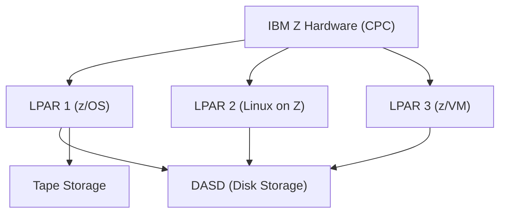

---

## 2. Subsystems and Component Integration

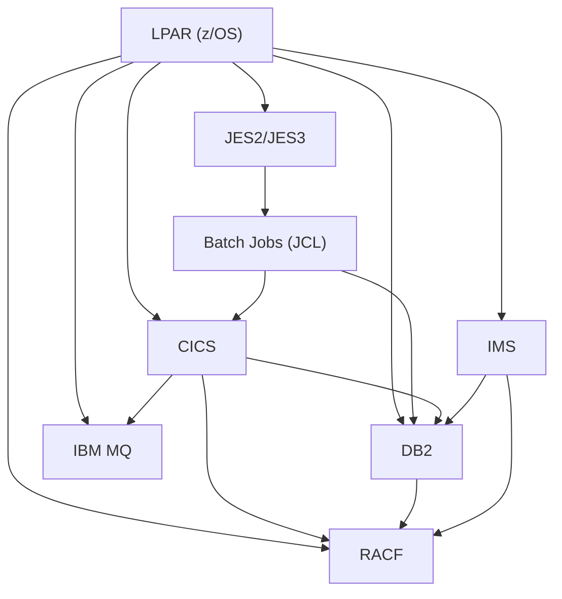

---

## 3. COBOL-DB2 Batch Processing Flow

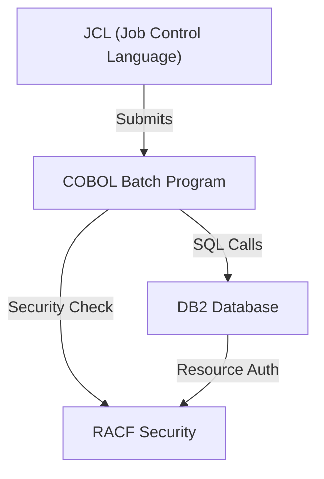

---

## 4. Security and Resource Validation

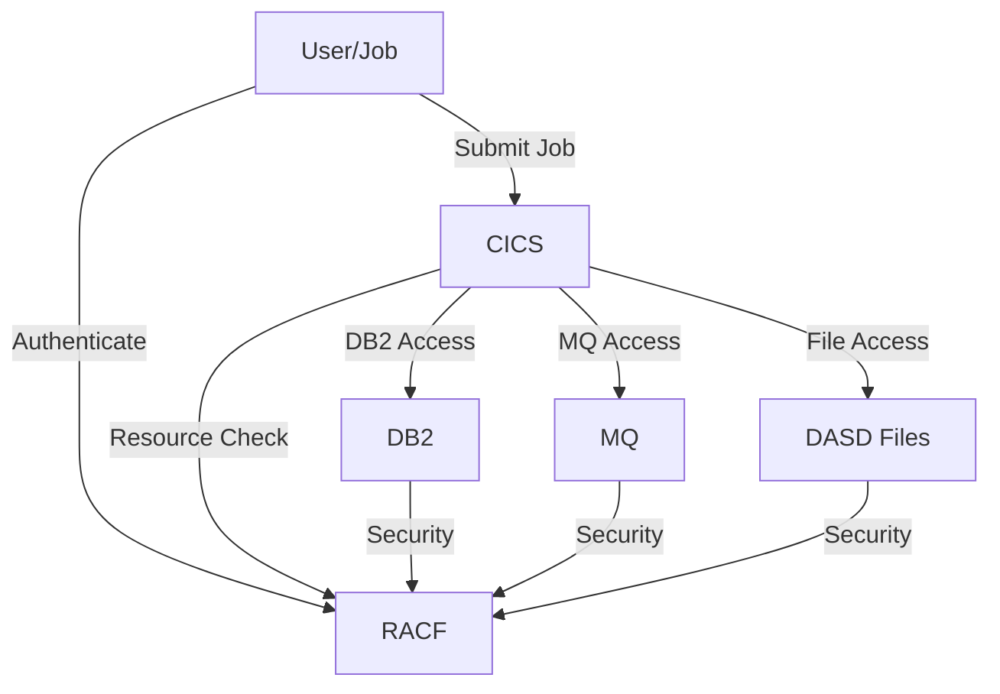

---

## 5. Modernization and API Enablement

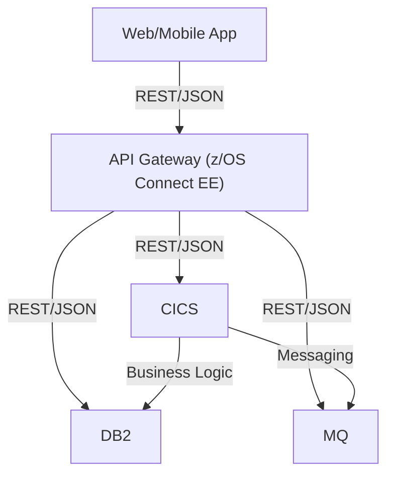

---

## 6. ASCII Art: Mainframe System Overview

```
+-------------------+      +-------------------+      +-------------------+
| 3270 Terminal     |----->| VTAM/SNA          |----->| CICS TCP          |
+-------------------+      +-------------------+      +-------------------+
        |                                                    |
        v                                                    v
+-------------------+      +-------------------+      +-------------------+
| Web/REST Client   |----->| z/OS Connect EE   |----->| CICS Web Support  |
+-------------------+      +-------------------+      +-------------------+
        |                                                    |
        v                                                    v
+-------------------+      +-------------------+      +-------------------+
| MQ Producer       |----->| MQ Bridge/Listener|----->| CICS MQ Adapter   |
+-------------------+      +-------------------+      +-------------------+
        |                                                    |
        v                                                    v
+-------------------+      +-------------------+      +-------------------+
| Batch Job         |----->| EXCI API          |----->| CICS EXCI Adapter |
+-------------------+      +-------------------+      +-------------------+
        |                                                    |
        v                                                    v
```

---

## 7. Batch Processing Flow and DASD/DB2 Dependency

### 7.1 Batch Job Flow (JCL, COBOL, DB2, DASD)

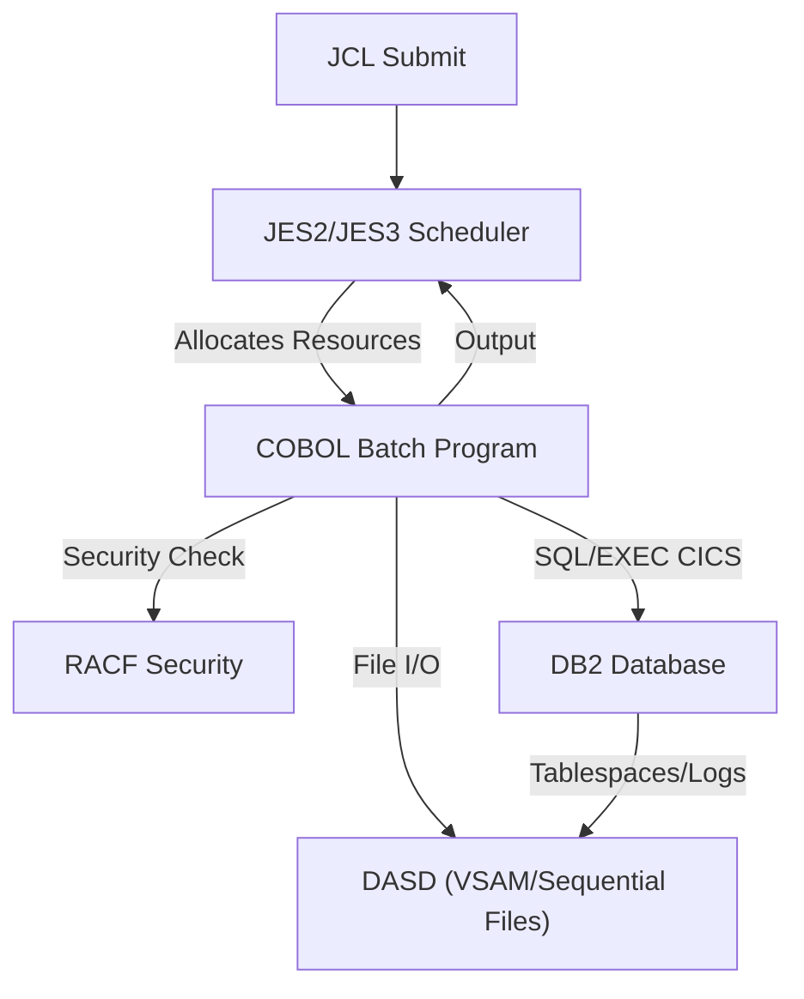

### 7.2 ASCII Art: Batch, DASD, and DB2

```
+-----------+     +-----------+     +-----------+     +-----------+
|  JCL Job  | --> |  JES2/3   | --> |  COBOL    | --> |  RACF     |
+-----------+     +-----------+     +-----------+     +-----------+
                                         |
                                         v
                                   +-----------+
                                   |   DB2     |
                                   +-----------+
                                         |
                                         v
                                   +-----------+
                                   |   DASD     |
                                   +-----------+

COBOL batch jobs can access DB2 (for SQL) and DASD (for file I/O). DB2 itself stores data on DASD.
```

---

### 7.3 Key Points
- Batch jobs are submitted via JCL and managed by JES2/JES3.
- COBOL batch programs can access DB2 using embedded SQL and DASD for file operations (VSAM, sequential datasets).
- DB2 stores all tablespaces, indexes, and logs on DASD.
- RACF validates user and resource access for both DB2 and DASD.
- Resource allocation (memory, CPU, I/O) is managed by z/OS and WLM.

---

**Tip:** Copy Mermaid code blocks into a Mermaid-enabled markdown editor or VS Code extension to view diagrams interactively.

---

## 8. Modern Mainframe Offerings: USS, z/Linux, zIIP, and More

### 8.1 UNIX System Services (USS)
- USS is a POSIX-compliant UNIX environment integrated into z/OS.
- Allows running shell scripts, UNIX utilities, and open-source software (Python, Node.js, etc.) natively on z/OS.
- Enables porting of UNIX/Linux applications to the mainframe.
- Used for DevOps tooling, web servers (Apache, NGINX), and hybrid workloads.

### 8.2 z/Linux (Linux on Z)
- Full-featured Linux distributions (RHEL, SUSE, Ubuntu) run natively on IBM Z hardware, either in LPARs or under z/VM.
- Supports open-source stacks, containers, and cloud-native workloads.
- Used for web servers, application servers, databases, and integration with distributed/cloud environments.
- Enables consolidation of Linux and z/OS workloads on a single mainframe.

### 8.3 zIIP (z Integrated Information Processor)
- Special-purpose processor for offloading eligible workloads from general-purpose CPUs (CPs).
- Handles DB2 analytics, XML parsing, Java, z/OS Connect, and select network workloads.
- Reduces software licensing costs (zIIP cycles are not charged like CP cycles).
- Improves overall system throughput and cost efficiency.

### 8.4 zAAP (z Application Assist Processor)
- (Legacy, now mostly replaced by zIIP) Used to offload Java workloads from general CPUs.
- Java workloads now typically run on zIIP.

### 8.5 IFL (Integrated Facility for Linux)
- Processor dedicated to running Linux workloads on IBM Z.
- Not used for z/OS, only for Linux on Z (z/Linux) LPARs or z/VM guests.
- Reduces cost of Linux processing on mainframe.

### 8.6 z/OS Container Extensions (zCX)
- Allows running Docker-compatible Linux containers natively on z/OS.
- Enables microservices, cloud-native apps, and open-source tools to run alongside traditional workloads.
- Bridges mainframe and cloud-native development.

### 8.7 Modern Use Cases and Integration
- Hybrid cloud: Seamless integration with IBM Cloud, AWS, Azure, and on-premises systems.
- DevOps: Git, Jenkins, Ansible, and other tools run on USS or z/Linux for CI/CD pipelines.
- API enablement: z/OS Connect EE exposes mainframe assets as REST APIs for web/mobile/cloud.
- Analytics: zIIP and z/OS analytics tools enable real-time insights on transactional data.
- Security: Centralized with RACF, supports modern encryption, MFA, and compliance.

---

### 8.8 Visual: Modern Mainframe Offerings

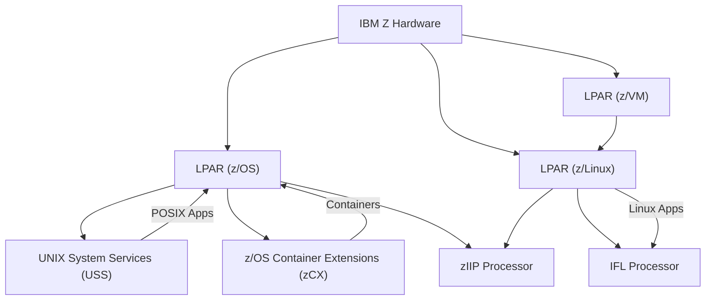

---

### 8.9 Summary Table

| Offering         | Purpose/Use Case                                      |
|-----------------|-------------------------------------------------------|
| USS             | UNIX environment on z/OS for scripts, open source     |
| z/Linux         | Native Linux on Z for open source, cloud, web         |
| zIIP            | Offload DB2, Java, analytics, APIs, reduce cost       |
| IFL             | Dedicated Linux processor, cost-effective Linux       |
| zCX             | Run Docker containers on z/OS, cloud-native bridge    |
| z/VM            | Virtualization, run many Linux/z/OS guests            |

---

## 9. Enterprise Environments: UNIT, IT, UAT, PROD

### 9.1 Visual: Environment Lifecycle and Promotion Flow

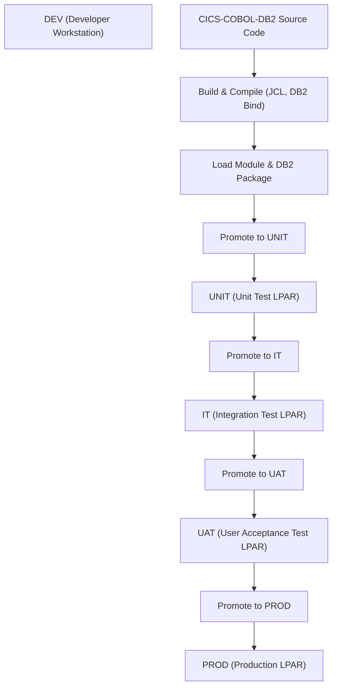

---

### 9.2 Example: CICS-COBOL-DB2 Code Promotion Steps
1. **Development:**
   - Developer writes COBOL-DB2 code and CICS maps on a workstation or in USS/z/Linux.
2. **Build:**
   - Code is compiled using JCL; DB2 precompiler generates DBRM.
   - DBRM is bound to a test plan/package in DB2.
   - Load module is created and stored in a test load library.
3. **Unit Test (UNIT):**
   - Code is tested in a dedicated LPAR with test CICS and DB2 subsystems.
   - Test datasets and DB2 tables are used.
4. **Integration Test (IT):**
   - Code is promoted to IT LPAR.
   - Integration with other applications, MQ, and external systems is tested.
5. **User Acceptance Test (UAT):**
   - Business users validate functionality in UAT LPAR.
   - Data is masked or subset of production.
6. **Production (PROD):**
   - Code is promoted to PROD LPAR.
   - Final DB2 bind to production plan/package.
   - Load module is copied to production libraries.
   - CICS resources (programs, transactions, maps) are defined in PROD CICS region.

---

### 9.3 Common Errors and Resolutions
| Error Type                | Example/Error Code         | Resolution                                    |
|---------------------------|---------------------------|-----------------------------------------------|
| DB2 Bind Error            | DSNT408I, -805            | Ensure correct DBRM/plan/package is bound and available in target DB2 subsystem. |
| Authorization Failure     | -551, NOTAUTH             | Grant required privileges in DB2 or RACF; check user/resource access.           |
| Load Module Not Found     | S806                      | Verify load library concatenation and module promotion.                        |
| CICS Program Not Defined  | AEI0, AEIQ                | Define program/transaction in CICS region (CSD update, newcopy).               |
| Data Mismatch             | SQLCODE -311, -302        | Check data types, lengths, and host variable definitions.                      |
| Environment Mismatch      | Plan/package not found    | Ensure correct plan/package is promoted and rebound in each environment.       |
| File/Dataset Not Found    | S213, S013                | Allocate required datasets; check JCL and catalog entries.                     |
| MQ Connection Error       | MQRC 2059, 2035           | Verify MQ queue manager/channel definitions and security.                      |

---

### 9.4 Additional Notes
- Automated tools (Endevor, ISPW, UrbanCode) are often used for code promotion and environment management.
- Each environment typically has its own CICS, DB2, MQ, and dataset instances for isolation.
- Data masking and refresh processes are used to protect sensitive data in non-prod environments.
- Regression and performance testing are performed before PROD promotion.
- Change management and approvals are required for PROD moves.

---

## 10. Security Implementation Across Environments

### 10.1 RACF in Enterprise Environments
- Each environment (UNIT, IT, UAT, PROD) typically has its own RACF database or isolated security definitions.
- RACF manages user IDs, permissions, and resource access for each LPAR/environment.
- This ensures test users and permissions do not impact production security.

### 10.2 RACF Role in Authentication and Authorization
- **Authentication:** RACF validates user credentials (password, MFA, certificates) at login or job submission.
- **Authorization:** RACF checks if the user/program has permission to access datasets, DB2 tables, CICS transactions, MQ queues, etc.
- RACF rules are defined for both human users and non-human (batch/service) IDs.

### 10.3 Programmatic Access: Non-Human RACF IDs
- Batch jobs and application servers use non-human (service) RACF IDs for automated access.
- These IDs are granted only the minimum required permissions (principle of least privilege).
- To access DB2 tables or VSAM files, the program/job must run under a RACF ID with explicit access to those resources.
- DB2 also checks its own internal privileges (GRANT/REVOKE) in addition to RACF dataset/table access.

### 10.4 Example: Granting Program Access to DB2 and VSAM
- RACF profile for DB2 resource: `DSNDB2.DATASET.PAYROLL` (for DB2 tablespace)
- RACF profile for VSAM file: `PROD.PAYROLL.VSAM`
- Grant access:
  - `PERMIT DSNDB2.DATASET.PAYROLL CLASS=DATASET ID=PAYBATCH ACCESS=READ`
  - `PERMIT PROD.PAYROLL.VSAM CLASS=DATASET ID=PAYBATCH ACCESS=UPDATE`
- In DB2: `GRANT SELECT, UPDATE ON PAYROLL TO PAYBATCH`

### 10.5 REST API Access via z/OS Connect and RACF
- REST API calls to z/OS Connect can use:
  - RACF authentication (client certificate, JWT, or RACF password)
  - Or basic authentication (user/password, often mapped to a RACF ID)
- z/OS Connect validates the credentials and maps to a RACF ID.
- RACF then authorizes access to CICS transactions, DB2 tables, or other resources.
- API-level security can be enhanced with OAuth, JWT, or API gateway policies.

#### Example Flow: Enterprise App Calling CICS/DB2 via z/OS Connect
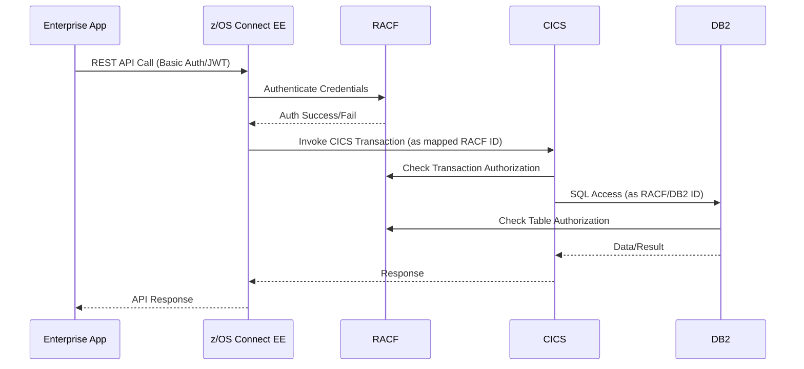

---

### 10.6 Key Points
- Each environment can have its own RACF database or isolated security rules.
- RACF is central to both authentication (who are you?) and authorization (what can you do?).
- Non-human IDs are used for batch and service access, with tightly controlled permissions.
- DB2 and VSAM access require both RACF and internal DB2/VSAM permissions.
- REST API calls via z/OS Connect are authenticated and authorized by RACF, with support for modern auth (JWT, OAuth).

---

### 10.7 Further Resources
- IBM Redbook: [Security on IBM Z](https://www.redbooks.ibm.com/abstracts/sg248410.html)
- IBM RACF Documentation: [RACF Security Administrator's Guide](https://www.ibm.com/docs/en/zos/2.5.0?topic=zos-racf)
- IBM z/OS Connect EE: [API Security](https://www.ibm.com/docs/en/zosconnect/3.0?topic=security)
- IBM DB2 for z/OS: [Security and Auditing](https://www.ibm.com/docs/en/db2-for-zos/12?topic=security)

---

## 11. Security Scenario: Mainframe Calling an External Application

### 11.1 Scenario Overview
A COBOL-DB2 batch program running on z/OS needs to call an external REST API (e.g., a payment gateway or cloud service) to process transactions. Security must be enforced for outbound calls, and sensitive data must be protected.

### 11.2 Security Flow
1. **Program Initiation:**
   - The batch job runs under a non-human RACF ID (e.g., PAYBATCH).
2. **RACF Authorization:**
   - RACF validates the job's authority to access required datasets, DB2 tables, and the TCP/IP stack for outbound connections.
3. **Outbound Call Preparation:**
   - The COBOL program uses a mainframe HTTP client (e.g., IBM z/OS Client Web Enablement Toolkit, CICS Web Services, or USS curl) to prepare the REST API call.
   - Credentials (API key, OAuth token, or client certificate) are securely stored (e.g., RACF keyring, z/OS SAF, or encrypted dataset).
4. **Outbound Connection:**
   - The HTTP client establishes a secure TLS/SSL connection to the external API endpoint.
   - Client authentication is performed using the stored credentials.
5. **API Call:**
   - The mainframe sends the request, including authentication headers (e.g., OAuth token, API key, or client certificate).
6. **External System Authorization:**
   - The external application validates the credentials and authorizes the request.
7. **Response Handling:**
   - The mainframe receives the response, processes the result, and logs the transaction securely.

### 11.3 Visual: Mainframe Outbound Secure API Call

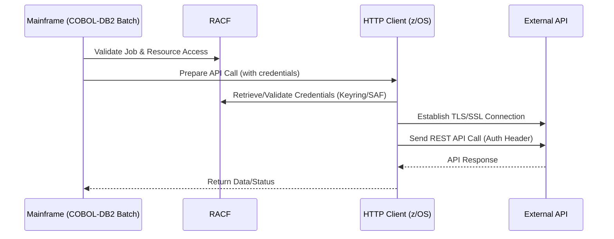

---

### 11.4 Key Security Points
- Outbound connections require explicit RACF permission to use TCP/IP and access credentials.
- Credentials for external APIs are stored securely (never hardcoded in code or JCL).
- All data in transit is encrypted (TLS/SSL).
- Outbound calls are logged and auditable for compliance.
- RACF and z/OS SAF can manage certificates and keyrings for client authentication.

---

### 11.5 Further Reading
- IBM Redbook: [Securing Communications with z/OS Encryption](https://www.redbooks.ibm.com/abstracts/sg248410.html)
- IBM z/OS Client Web Enablement Toolkit: [Documentation](https://www.ibm.com/docs/en/zos/2.5.0?topic=toolkit-client-web-enablement)
- IBM RACF: [Managing Digital Certificates](https://www.ibm.com/docs/en/zos/2.5.0?topic=certificates-managing-digital)

---

### 11.6 Technical Deep Dive: Mainframe Outbound API Security

#### 1. RACF Permissions for Outbound Calls
- The batch job's RACF ID (e.g., PAYBATCH) must have:
  - READ access to the TCP/IP stack profile (e.g., `EZB.NETACCESS`)
  - READ access to the keyring or certificate profile (e.g., `IRR.DIGTCERT.LIST`) if using client certificates
  - READ/UPDATE access to any datasets used for storing credentials (e.g., encrypted password files)
- Example RACF commands:
  - `PERMIT EZB.NETACCESS CLASS=FACILITY ID=PAYBATCH ACCESS=READ`
  - `PERMIT IRR.DIGTCERT.LIST CLASS=FACILITY ID=PAYBATCH ACCESS=READ`

#### 2. Secure Credential Storage
- Credentials (API keys, OAuth tokens, passwords) should be stored in:
  - RACF keyring (for certificates)
  - z/OS UNIX System Services (USS) protected files
  - z/OS Security Server (SAF) protected resources
- Never hardcode credentials in COBOL source or JCL.
- Use encryption and access controls for all credential storage.

#### 3. TLS/SSL Setup
- Outbound HTTP clients (e.g., z/OS Client Web Enablement Toolkit, USS curl, CICS Web Services) require:
  - A valid client certificate (if mutual TLS is required)
  - The CA certificate for the external API endpoint
  - RACF keyring or SAF-managed certificate store
- Example JCL for running USS curl with a certificate:
  ```jcl
  //STEP1 EXEC PGM=BPXBATCH,PARM='sh curl --cert /u/paybatch/cert.pem --key /u/paybatch/key.pem https://api.example.com/payments'
  ```
  

#### 4. Outbound HTTP Client Options
- **z/OS Client Web Enablement Toolkit:**
  - Callable from COBOL, PL/I, C, and assembler
  - Supports HTTP/HTTPS, custom headers, and SSL
- **USS curl:**
  - Open-source tool available in USS
  - Supports all modern HTTP features
- **CICS Web Services:**
  - CICS region can act as HTTP client
  - Security context is inherited from the CICS transaction

#### 5. Logging and Auditing
- All outbound calls should be logged with:
  - Timestamp, RACF ID, target endpoint, request/response status
  - Errors and security events should be sent to SMF or SYSLOG
- Example log entry:
  ```
  2026-01-18 22:15:01 PAYBATCH Outbound API call to https://api.example.com/payments Status: 200 OK
  ```

#### 6. Error Handling
- Common errors:
  - `SSL handshake failed`: Certificate or keyring issue
  - `401 Unauthorized`: Invalid credentials or token
  - `403 Forbidden`: RACF or external API access denied
  - `S913`: RACF dataset or resource access denied
- Resolution:
  - Check RACF permissions, certificate/keyring setup, and external API credentials

---

### 11.7 Example: COBOL Calling External API (Pseudo-code)
```cobol
* Example: COBOL using CEEGTST (z/OS HTTP client)
CALL 'CEEGTST' USING
     HTTP-REQUEST-BLOCK,
     HTTP-RESPONSE-BLOCK,
     RETURN-CODE.
* HTTP-REQUEST-BLOCK contains URL, headers, credentials (from secure store)
* RETURN-CODE checked for errors (e.g., 401, 403, SSL errors)
```
## 12. z/OS vs z/VM vs Linux on Z: Differences, Purposes, and Use Cases

### 12.1 z/OS
- **Type:** Mainframe operating system (flagship IBM OS)
- **Primary Purpose:**
  - Enterprise transaction processing, batch processing, and data management
  - Runs critical workloads: CICS, IMS, DB2, batch jobs, JES2/JES3, RACF
- **Key Use Cases:**
  - High-volume banking, insurance, government, and retail transaction systems
  - Batch processing (JCL jobs, COBOL, PL/I)
  - Secure data hosting and regulatory compliance
  - Integration with modern APIs (z/OS Connect, REST, MQ)

### 12.2 z/VM
- **Type:** Mainframe hypervisor (virtualization OS)
- **Primary Purpose:**
  - Create and manage multiple virtual machines (VMs) on IBM Z hardware
  - Each VM can run its own OS (Linux, z/OS, z/VSE, etc.)
- **Key Use Cases:**
  - Server consolidation: run hundreds/thousands of Linux VMs on one mainframe
  - Test/dev environments for z/OS, Linux, or other mainframe OSes
  - Cloud and service provider platforms (multi-tenant)
  - Isolated sandboxes for application testing

### 12.3 Linux on Z
- **Type:** Linux distributions (RHEL, SUSE, Ubuntu) compiled for IBM Z architecture
- **Primary Purpose:**
  - Run open-source, cloud-native, and distributed workloads on mainframe hardware
  - Leverage mainframe reliability, security, and scalability for Linux apps
- **Key Use Cases:**
  - Web servers, application servers, databases (PostgreSQL, MongoDB, etc.)
  - Container platforms (OpenShift, Kubernetes)
  - DevOps tooling, CI/CD pipelines
  - Hybrid cloud integration and microservices
  - Modernization: co-locate Linux and z/OS workloads for tight integration

---

### 12.4 Visual: IBM Z Operating Environments

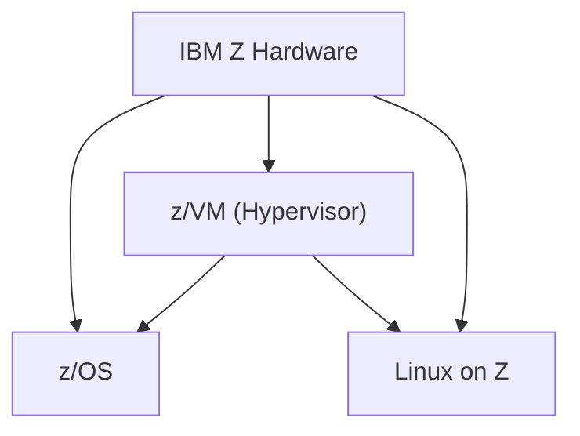

---

### 12.5 Summary Table
| Environment | Type         | Primary Purpose                        | Typical Use Cases                                  |
|-------------|--------------|----------------------------------------|----------------------------------------------------|
| z/OS        | OS           | Transaction & batch processing         | CICS, IMS, DB2, batch jobs, secure data hosting    |
| z/VM        | Hypervisor   | Virtualization, multi-OS hosting       | Linux VM farms, test/dev, cloud, multi-tenancy     |
| Linux on Z  | OS           | Open-source/cloud-native workloads     | Web/app servers, containers, DevOps, hybrid cloud  |

---


**Document Version:** 1.0  
**Date Created:** January 18, 2026  
**Purpose:** Visual Reference for Mainframe Architecture

